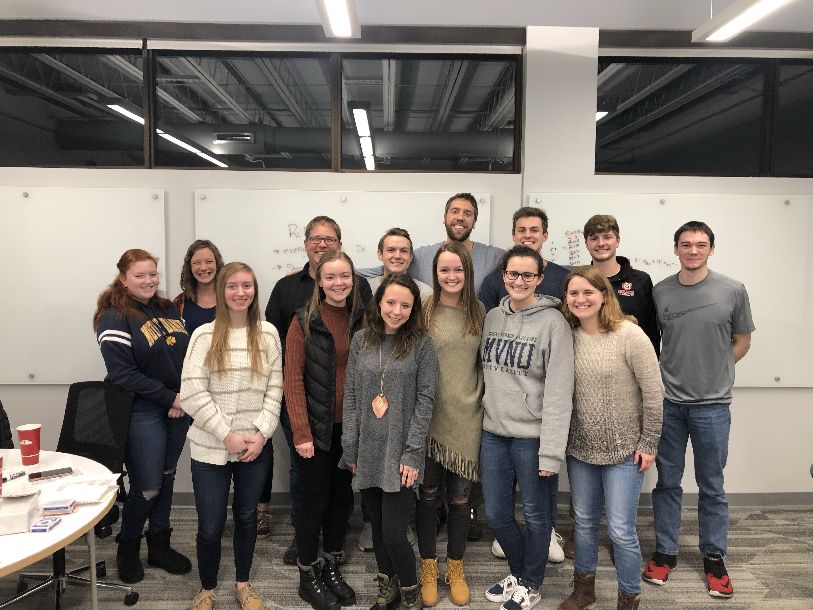

## A Social Get Together

### Majors from the math program got together to let off a little steam after some hard studying, especially the five Actuarial Science majors who took their first Probability Exam.

### Pizza and soda were provided by the Math Program, and Heidi Johnson baked cookies!

### The event was planned by Ellie Witmer, pictured on the left below as she plans her next move.

### A fun time was had by all!

